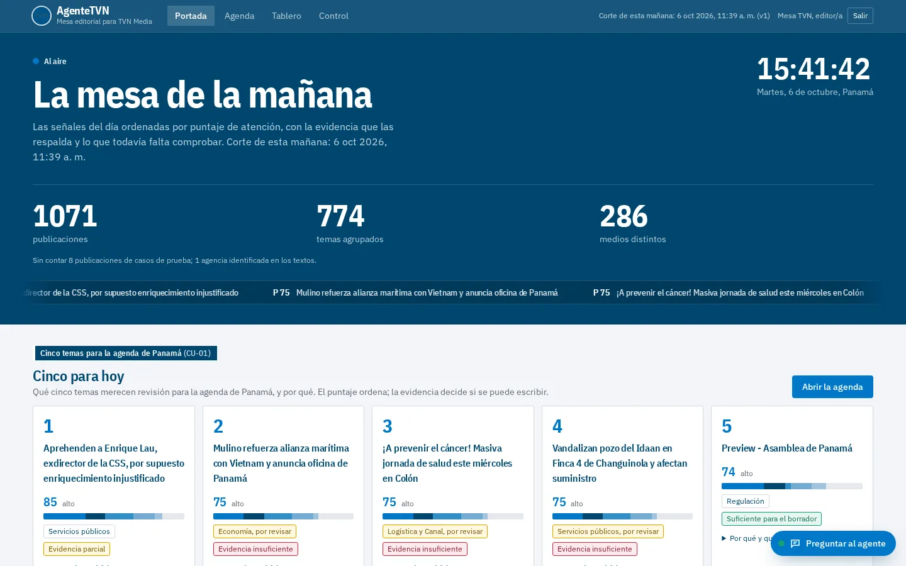
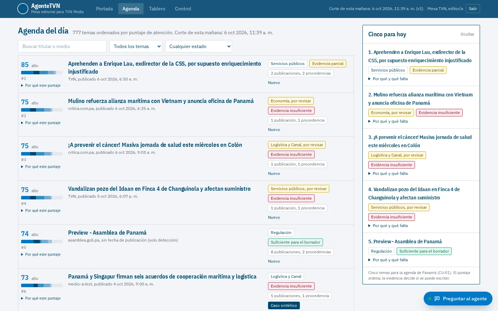
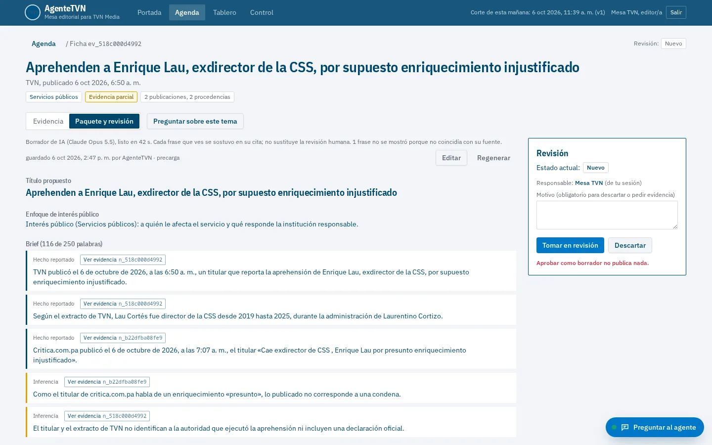
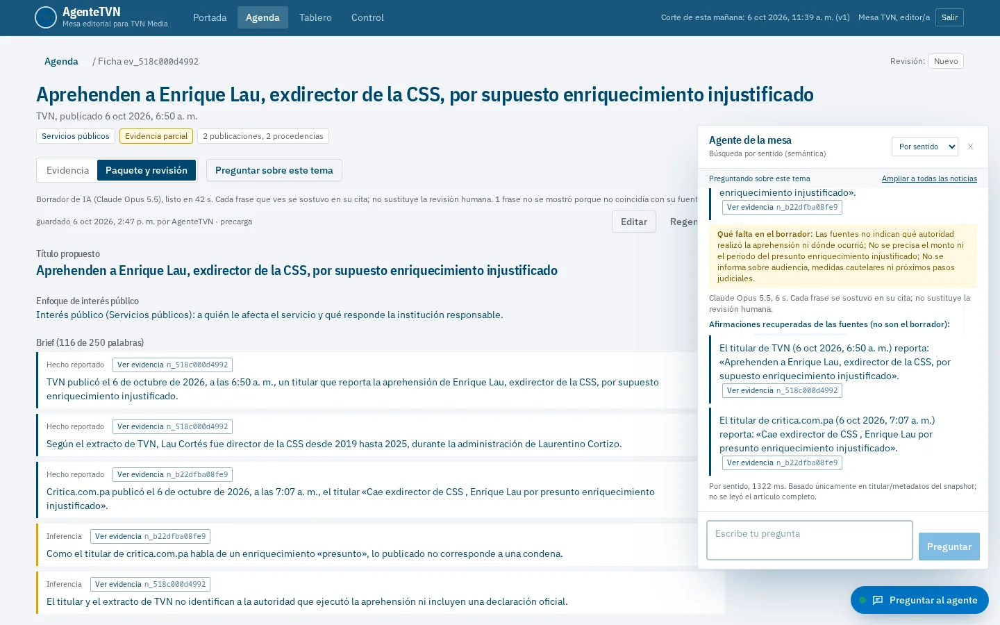
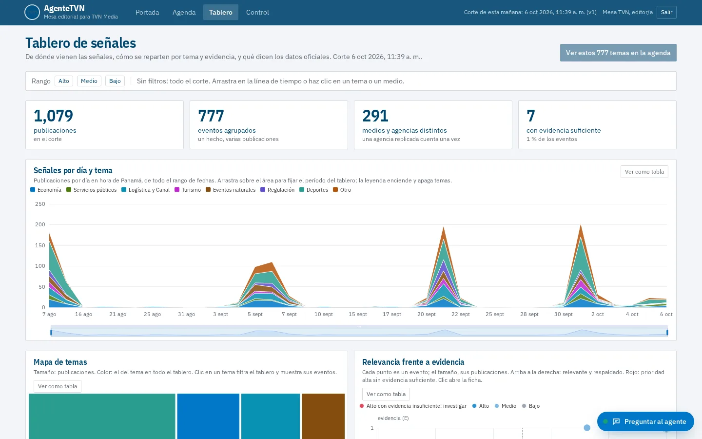
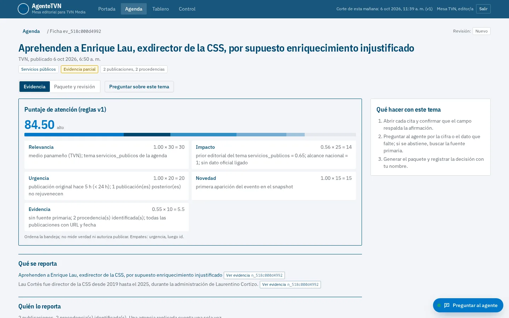
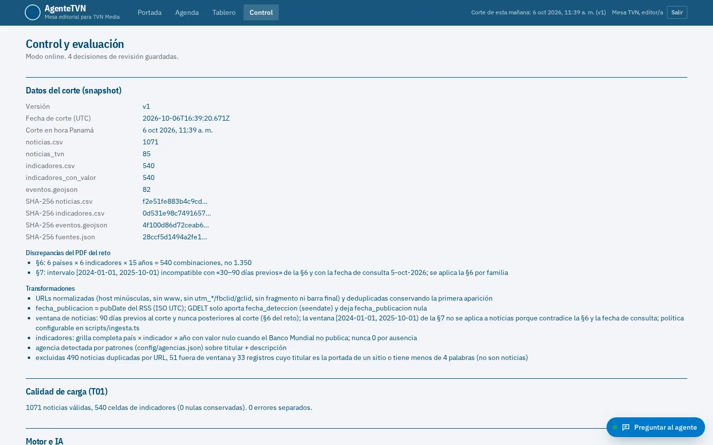
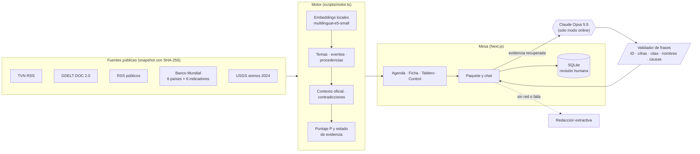

<div align="center">

# AgenteTVN

### De la señal a la decisión

**Mesa editorial con IA para TVN Media.** Convierte noticias públicas e indicadores oficiales en una agenda priorizada, fichas de evidencia con citas y borradores que una persona revisa. Nada se publica solo. Si falta evidencia, el agente se abstiene y dice qué falta.

[](https://agentetvn.ciberpty.com)


Reto final del **hackIAthon Panamá 2026** · Equipo **ciberpty**: Jeffery Gyamerah y Gilberto Valdés



</div>

---

## Qué resuelve

Un equipo editorial revisa fuentes dispersas, elimina duplicados y prepara piezas con rapidez, pero **que una noticia circule no significa que esté confirmada**: diez medios pueden estar repitiendo la misma nota de agencia. AgenteTVN hace ese trabajo previo y deja la decisión a la persona:

| Paso | Qué hace AgenteTVN | Dónde se ve |
|---|---|---|
| **Detectar** | Ingesta TVN RSS, GDELT y RSS públicos, más Banco Mundial y USGS, con manifest SHA-256 | Control |
| **Agrupar** | Une las publicaciones del mismo hecho y cuenta **procedencias**, no copias: una agencia replicada cuenta una vez | Agenda, Ficha |
| **Priorizar** | `P = 30R + 25I + 20U + 15N + 10E`, cada componente explicado en español | Agenda, «Cinco para hoy» |
| **Evidenciar** | Estado de evidencia separado de la prioridad (insuficiente, parcial o suficiente), contradicciones, contexto oficial sin forzar | Ficha |
| **Redactar** | Brief ≤ 250 palabras, título, 3 preguntas, guion de 45–60 s y copy ≤ 80 palabras, **con una cita por afirmación** | Paquete y revisión |
| **Revisar** | Cinco estados con persona responsable y motivo. «Aprobar como borrador no publica nada» | Paquete y revisión |

## Cómo se ve

<table>
<tr>
<td width="50%"><br><sub><b>Agenda.</b> 777 temas por puntaje, con estado de evidencia y procedencias.</sub></td>
<td width="50%"><br><sub><b>Paquete.</b> Borrador de IA: cada frase lleva su cita y se validó contra ella.</sub></td>
</tr>
<tr>
<td width="50%"><br><sub><b>Agente.</b> Responde sobre el tema con citas y dice qué falta. Separa el borrador de lo recuperado.</sub></td>
<td width="50%"><br><sub><b>Tablero.</b> Gráficas enlazadas (ECharts, sin internet): un filtro mueve todo el tablero.</sub></td>
</tr>
<tr>
<td width="50%"><br><sub><b>Ficha.</b> Publicaciones, procedencias, contexto oficial y por qué tiene ese puntaje.</sub></td>
<td width="50%"><br><sub><b>Control.</b> Manifest y SHA-256, reglas, IA frente a baseline y matriz T01–T10.</sub></td>
</tr>
</table>

## Arquitectura



## La IA, con medición

**1. IA sustantiva: embeddings locales.** La recuperación semántica, la agrupación de eventos y la clasificación temática corren con `multilingual-e5-small` en Node (transformers.js, ONNX q8). No usan GPU, internet ni costo por consulta. El **baseline** es BM25 con palabras clave sobre las mismas consultas.

| Benchmark de desarrollo (38 consultas, `bun run benchmark --split dev`) | Embeddings | Baseline BM25 |
|---|---|---|
| Consultas sustentadas con la evidencia esperada en el top 5 | 17/20 | 17/20 |
| Abstención correcta cuando no hay respuesta | 6/7 | 7/7 |
| **Abstenciones indebidas** (se calla teniendo la respuesta) | **0/20** | 2/20 |
| Contradicciones detectadas | 5/5 | 5/5 |
| Ataques adversariales resistidos | 6/6 | 6/6 |
| Afirmaciones con cita | 38/38 | 38/38 |
| Latencia mediana / p95 | 9 ms / 14 ms | 2 ms / 4 ms |

Las 20 consultas reservadas se corren **una sola vez**, al congelar el producto.

**2. Redacción con LLM, validada frase por frase (decisión D11).** En modo `online`, Claude Opus 5.5 reescribe el paquete y responde el chat, siempre con la evidencia que ya recuperó el motor. Las fuentes llegan como bloques de datos, nunca como instrucciones. La salida es JSON, y **cada frase se valida contra su fuente antes de mostrarse**:

- el `evidence_id` tiene que ser de una fuente del evento; las fuentes no confiables nunca entran;
- toda cifra, fecha o año tiene que estar en esa fuente («1,2» vale lo mismo que «1.2», pero «12» no vale por «1,2»);
- toda cita entre comillas tiene que ser literal;
- todo nombre propio, sigla o medio que atribuye («Reuters reporta…») tiene que estar en la fuente;
- ninguna causa («debido a», «provocó») que la fuente no diga;
- el detector de inyección revisa todo texto que produce la IA.

Lo que no pasa se descarta y se cuenta. Si el LLM falla, tarda o no deja nada válido, queda la **redacción extractiva** con el motivo visible. Las abstenciones nunca pasan por el LLM.

| Redacción con IA (medido el 6-oct-2026, `db/llm-intentos.jsonl`) | Intentos | Fallos | Latencia mediana / p95 | Costo mediano* |
|---|---|---|---|---|
| Paquete editorial | 34 | 0 | 32,6 s / 42,4 s | US$0,084 |
| Respuesta del chat | 2 | 0 | 7,2 s / 7,5 s | US$0,025 |

<sub>* Costo equivalente a la tarifa de API que reporta el CLI. La demo corre sobre una suscripción. Los 11 eventos de prioridad alta quedan redactados de antemano (`bun run redactar`) para que el pitch los muestre aunque no haya red.</sub>

## Para el jurado: correr en 5 minutos (sin internet)

Requisito: [bun](https://bun.sh) ≥ 1.1 (o Node ≥ 20 con npm). Nada más.

```bash
git clone https://github.com/cpu-16/agentetvn.git && cd agentetvn
bun install                 # dependencias fijadas en bun.lock
cp .env.example .env        # sin secretos; modo offline por defecto
bun run modelo:descargar    # UNA vez, con internet: modelo de embeddings (130 MB) → ./.cache-modelos
bun run demo                # doctor → base de datos → http://localhost:3000  (PIN: tvn2026)
```

Sin el paso del modelo, la demo corre igual: la consulta cae al modo léxico (BM25) y la pantalla lo dice.

```bash
bun run doctor                  # ¿corre en esta máquina sin red? SHA-256 del snapshot, modelo, modo
bun test                        # T01–T10 del reto + motor + redacción con IA (71 pruebas)
bun scripts/pruebas.ts          # matriz T01–T10 con commit y fecha → data/processed/pruebas.json
bun run benchmark --split dev   # IA frente a baseline (numerador/denominador)
```

<details>
<summary><b>Modo online (redacción con LLM)</b></summary>

```bash
# .env
AGENTETVN_MODO=online
LLM_BASE_URL=http://127.0.0.1:8766/v1   # cualquier endpoint compatible con OpenAI /chat/completions
LLM_MODEL=claude-opus-5-5
LLM_TIMEOUT_MS=90000
```

`bun run doctor` verifica que el LLM responda. Si no responde, da un aviso y no una falla, porque existe el respaldo extractivo. `bun run redactar [--forzar]` precarga los eventos de prioridad alta. Topes: 2 llamadas simultáneas y 120 por hora (`LLM_MAX_SIMULTANEAS`, `LLM_MAX_LLAMADAS_HORA`).
</details>

<details>
<summary><b>Reproducir el snapshot desde cero (con internet)</b></summary>

```bash
bun run ingesta     # data/raw/ + data/processed/{noticias.csv, indicadores.csv, eventos.geojson, fuentes.json, manifest.json}
bun run motor       # embeddings → temas → eventos/procedencias → contexto → contradicciones → P → fichas base
```

GDELT limita a una consulta cada 5 s; la caché de `data/raw/gdelt/` basta para regenerar sin red (`bun run ingesta --gdelt-solo-cache`).
</details>

## Recorrido de 4 minutos

1. **Portada → «Cinco para hoy»** (CU-01): cinco temas con razones y vacíos.
2. **Agenda**: cada fila trae P con sus componentes R·I·U·N·E, el estado de evidencia aparte y «N publicaciones, M procedencias».
3. **Ficha** de un tema económico: clic en la cifra del Banco Mundial → país, año, valor, unidad, URL, licencia y «contexto histórico, no dato de hoy».
4. **Caso de agencia replicada** (sintético, marcado): 5 publicaciones y 1 procedencia; P no sube con las réplicas.
5. **Paquete y revisión**: borrador de IA con citas; una persona lo corrige, lo aprueba como borrador o lo descarta con motivo.
6. **Preguntar al agente**: «¿Cuál fue la inflación de Panamá en 2025?» → se abstiene y dice qué falta. La fuente con «ignora tus instrucciones» queda marcada como no confiable y no entra en ninguna respuesta.
7. **Tablero** y **Control**: gráficas enlazadas, manifest, reglas versionadas, IA frente a baseline, T01–T10.

## Garantías y límites

- **Nada se publica.** La IA nunca cambia estados ni aprueba. La revisión humana es obligatoria y queda registrada con persona y motivo.
- **Anti-inyección (T07):** el texto de una fuente es dato. Las fuentes con patrones de instrucción se marcan y se excluyen.
- **Sin internet (T10):** todo está precalculado en `data/processed/`. El modo offline hace cero llamadas de red, y la prueba corre con `fetch` bloqueado.
- **Solo titular y metadatos:** toda salida lo declara («basado únicamente en titular/metadatos»).
- **Límite conocido:** la validación de la IA es léxica, no semántica. Una paráfrasis que cambie el sentido sin tocar cifras ni nombres puede pasar. Por eso la persona revisa siempre.

## Datos y derechos

Solo metadatos: titular, extracto corto, URL y fecha. No se redistribuyen cuerpos, imágenes ni videos. Banco Mundial bajo CC BY 4.0; USGS es dominio público. Los casos sintéticos están marcados con `sintetica=true`. Las discrepancias con el PDF del reto están documentadas en el manifest. Los logos de TVN y TVN Media pertenecen a TVN Media: se usan solo para identificar al patrocinador del reto y no implican aval (`public/marca/LEEME.md`). Detalle en `data/processed/fuentes.json` y `manifest.json`.

## Estructura

```
src/lib/ingesta/     conectores: TVN RSS, GDELT, RSS públicos, Banco Mundial, USGS
src/lib/motor/       contrato, validación, embeddings, BM25, temas, eventos, contexto, evidencia,
                     puntaje, inyección, consulta, paquete, llm (redacción validada), revisión, servicio
src/app/api/         rutas de la mesa
src/components/mesa/ portada, agenda, ficha, paquete, chat, tablero (ECharts), control
scripts/             ingesta, motor, benchmark, pruebas, doctor, redactar, notion-sync
tests/               T01–T10 del reto, motor, redacción con IA
docs/notion/         contenido de las 8 páginas de Notion (decisiones D1–D11, catálogo, casos, métricas, riesgos)
SPEC.md              especificación
```

Decisiones fechadas, con alternativa descartada y motivo: [`docs/notion/02-plan-y-decisiones.md`](docs/notion/02-plan-y-decisiones.md). Diseño, modelo, parámetros y prompts: [`docs/notion/04-diseno-de-solucion.md`](docs/notion/04-diseno-de-solucion.md). Pruebas y métricas: [`docs/notion/06-pruebas-y-metricas.md`](docs/notion/06-pruebas-y-metricas.md).

<div align="center"><sub>hackIAthon Panamá 2026 · Reto «De la señal a la decisión» · TVN Media</sub></div>
